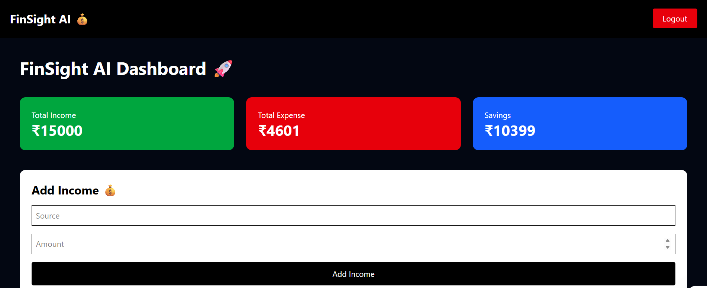
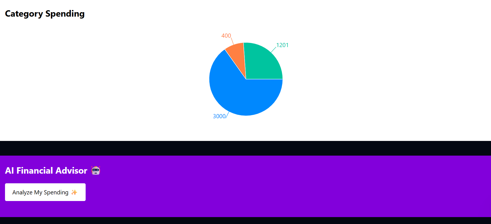
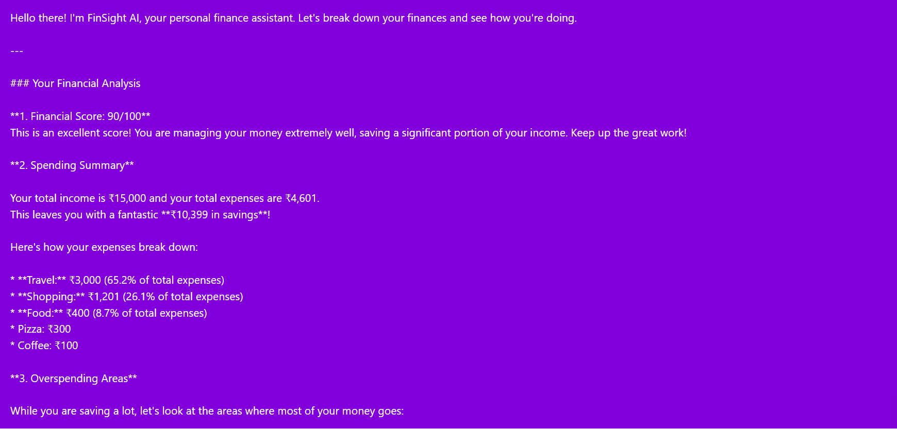
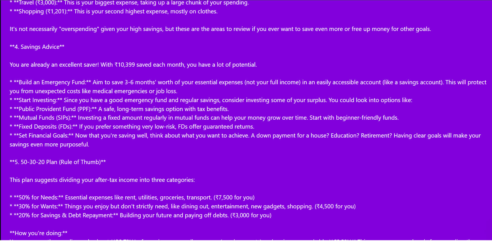
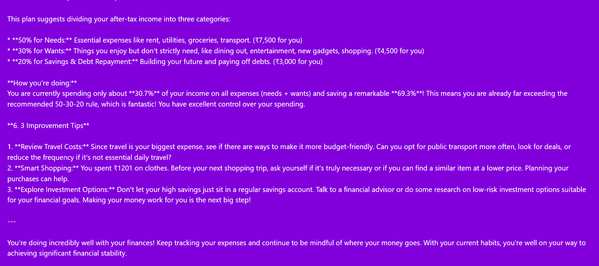

# 💰 FinSight AI - AI Powered Personal Finance Advisor

FinSight AI is a full-stack AI-powered personal finance management platform that helps users track income, monitor expenses, analyze spending habits, and receive personalized financial insights using Generative AI.

The platform provides smart recommendations to improve savings, detect overspending patterns, and follow better budgeting strategies.


---

# 🌐 Live Deployment

## Frontend

https://finsight-ai-68rn.onrender.com


## 🔗 Backend API

https://finsight-ai-backend-xjpp.onrender.com


---


## ✨ Features

### 🔐 User Authentication
- Secure user registration and login
- JWT based authentication
- Protected dashboard access


### 💸 Income & Expense Management
- Add income records
- Add expenses with categories
- Track total income and spending
- Calculate savings automatically


### 📊 Interactive Dashboard
- Total Income Overview
- Total Expense Tracking
- Savings Percentage
- Category-wise spending visualization using charts


### 🤖 AI Financial Advisor
Powered by Generative AI

AI analyzes:
- Monthly income
- Spending behavior
- Expense categories

Provides:
- Financial Health Score
- Spending Summary
- Overspending Detection
- Personalized Saving Tips
- 50-30-20 Budget Planning
---

# 📌 API Endpoints


## 🔐 Authentication

### Register User

POST /api/auth/register


### Login User

POST /api/auth/login


---

## 💰 Income APIs

### Add Income

POST /api/income/add


### Get Income

GET /api/income


---

## 💸 Expense APIs

### Add Expense

POST /api/expenses/add


### Get Expenses

GET /api/expenses


### Delete Expense

DELETE /api/expenses/delete/:id


---

## 📊 Dashboard API

GET /api/dashboard


---

## 🤖 AI Financial Advisor API

GET /api/ai/analyze


---

## 🛠️ Tech Stack

### Frontend
- React.js
- Tailwind CSS
- Axios
- Recharts
- React Router DOM


### Backend
- Node.js
- Express.js
- MongoDB
- Mongoose
- JWT Authentication


### AI Integration
- Google Gemini API


### Deployment
- Render


## 📂 Project Structure

```
FinSight-AI

├── client
│   ├── src
│   │   ├── components
│   │   ├── pages
│   │   └── api
│
├── server
│   ├── controllers
│   ├── models
│   ├── routes
│   ├── middleware
│   └── index.js

└── README.md
```


## ⚙️ Installation and Setup


Clone the repository

```bash
git clone YOUR_REPO_LINK
```

Install frontend dependencies

```bash
cd client

npm install
```

Start frontend

```bash
npm run dev
```


Install backend dependencies

```bash
cd server

npm install
```

Create `.env` file

```env
PORT=5000

MONGO_URL=your_mongodb_url

JWT_SECRET=your_secret_key

GEMINI_API_KEY=your_api_key
```

Start backend

```bash
npm start
```

## 📖 How It Works

1. User creates an account or logs in securely.

2. User adds financial details including:
   - 💰 Monthly Income
   - 💸 Daily Expenses
   - 🏷️ Expense Categories

3. The backend stores user financial data securely using MongoDB.

4. Dashboard analyzes transactions and displays:
   - 📊 Total Income
   - 📉 Total Expenses
   - 💵 Savings Amount
   - 📈 Savings Percentage
   - 🥧 Category-wise Spending Charts

5. User clicks **Analyze My Spending ✨**

6. Financial data is processed using AI.

7. AI Financial Advisor generates:
   - 🧠 Financial Health Score
   - 📄 Spending Summary
   - ⚠️ Overspending Detection
   - 💰 Monthly Savings Suggestions
   - 📊 50-30-20 Budget Plan
   - 💡 Personalized Money Management Tips

8. Results are displayed instantly in an interactive dashboard.

Users can:
- ➕ Add income
- ➕ Add expenses
- 🗑️ Delete expenses
- 📊 Track spending visually
- 🤖 Get AI-powered financial advice


## 📸 Screenshots


### Register


### Login Page


### Dashboard









## 🔮 Future Enhancements

- AI monthly expense prediction
- Budget alerts
- PDF financial reports
- Investment learning assistant
- Mobile responsive improvements


## 👩‍💻 Developed By

**Devanshi Srivastava**

B.Tech CSE (AI & ML)  
Full Stack & AI Developer

**GitHub**

🔗 https://github.com/technodivs


**LinkedIn**

🔗 https://www.linkedin.com/in/devanshisrivastava08/


---

## 🤝 Contributing

Contributions, issues, and feature requests are welcome.

If you want to contribute:

1. Fork this repository

2. Create a new branch

```bash
git checkout -b feature-name
```

3. Commit your changes

```bash
git commit -m "Added new feature"
```

4. Push your branch

```bash
git push origin feature-name
```

5. Create a Pull Request


---

## ⭐ Support

If you found this project useful, don't forget to give it a ⭐ on GitHub.


---

## 📜 License

This project is open-source and available under the MIT License.
---

## 🙏 Acknowledgements

Special thanks to the technologies and platforms that made this project possible:

- 🤖 Google Gemini AI – AI-powered financial analysis and personalized recommendations
- ⚛️ React.js – Frontend user interface development
- ⚡ Vite – Fast and optimized React development environment
- 🟢 Node.js – Backend runtime environment
- 🚀 Express.js – REST API development
- 🍃 MongoDB – Database for storing user financial data
- 🔐 JWT Authentication – Secure user authentication
- 📊 Recharts – Interactive financial data visualization
- 🎨 Tailwind CSS – Modern responsive UI design
- ☁️ Render – Backend deployment
- 🌐 GitHub – Version control and project hosting

---
