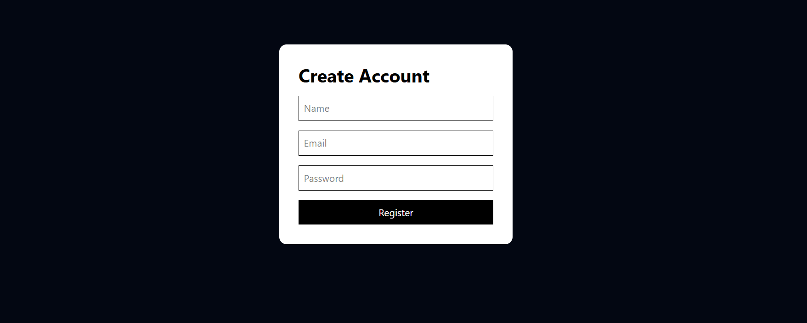
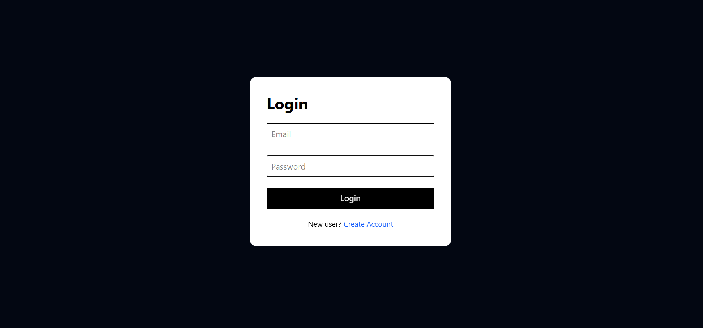

# 💰 FinSight AI - AI Powered Personal Finance Advisor

FinSight AI is a full-stack AI-powered personal finance management platform that helps users track income, monitor expenses, analyze spending habits, and receive personalized financial insights using Generative AI.

The platform provides smart recommendations to improve savings, detect overspending patterns, and follow better budgeting strategies.


## 🚀 Live Demo

🔗 Frontend: Add your deployed frontend URL here  
🔗 Backend API: Add your backend URL here


## ✨ Features

### 🔐 User Authentication
- Secure user registration and login
- JWT based authentication
- Protected dashboard access


### 💸 Income & Expense Management
- Add income records
- Add expenses with categories
- Track total income and spending
- Calculate savings automatically


### 📊 Interactive Dashboard
- Total Income Overview
- Total Expense Tracking
- Savings Percentage
- Category-wise spending visualization using charts


### 🤖 AI Financial Advisor
Powered by Generative AI

AI analyzes:
- Monthly income
- Spending behavior
- Expense categories

Provides:
- Financial Health Score
- Spending Summary
- Overspending Detection
- Personalized Saving Tips
- 50-30-20 Budget Planning


## 🛠️ Tech Stack

### Frontend
- React.js
- Tailwind CSS
- Axios
- Recharts
- React Router DOM


### Backend
- Node.js
- Express.js
- MongoDB
- Mongoose
- JWT Authentication


### AI Integration
- Google Gemini API


### Deployment
- Render


## 📂 Project Structure

```
FinSight-AI

├── client
│   ├── src
│   │   ├── components
│   │   ├── pages
│   │   └── api
│
├── server
│   ├── controllers
│   ├── models
│   ├── routes
│   ├── middleware
│   └── index.js

└── README.md
```


## ⚙️ Installation and Setup


Clone the repository

```bash
git clone YOUR_REPO_LINK
```

Install frontend dependencies

```bash
cd client

npm install
```

Start frontend

```bash
npm run dev
```


Install backend dependencies

```bash
cd server

npm install
```

Create `.env` file

```env
PORT=5000

MONGO_URL=your_mongodb_url

JWT_SECRET=your_secret_key

GEMINI_API_KEY=your_api_key
```

Start backend

```bash
npm start
```


## 📸 Screenshots
## 📸 Screenshots

### Register



### Login Page




### Dashboard


## 🔮 Future Enhancements

- AI monthly expense prediction
- Budget alerts
- PDF financial reports
- Investment learning assistant
- Mobile responsive improvements


## 👩‍💻 Developed By

**Devanshi Srivastava**

B.Tech CSE (AI & ML)  
Full Stack Developer


## ⭐ Support

If you like this project, give it a ⭐ on GitHub!